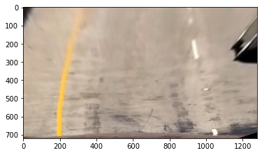

The goals / steps of this project are the following:


* Compute the camera calibration matrix and distortion coefficients given a set of chessboard images.
* Apply a distortion correction to raw images.
* Apply a perspective transform to rectify binary image ("birds-eye view").
* Use color transforms, gradients, etc., to create a thresholded binary image.
* Detect lane pixels and fit to find the lane boundary.
* Determine the curvature of the lane and vehicle position with respect to center.
* Warp the detected lane boundaries back onto the original image.
* Output visual display of the lane boundaries and numerical estimation of lane curvature and vehicle position.

The images for camera calibration are stored in the folder called `camera_cal`.  The images in `test_images` are for testing your pipeline on single frames.

The `challenge_video.mp4` video is an extra (and optional) challenge for you if you want to test your pipeline under somewhat trickier conditions.  The `harder_challenge.mp4` video is another optional challenge and is brutal!

If you're feeling ambitious (again, totally optional though), don't stop there!  We encourage you to go out and take video of your own, calibrate your camera and show us how you would implement this project from scratch!
## Steps on a frame

***********************

******************

******************

******************

******************

******************


## Usage:

```python
Lane Lines Detection pipeline
How to use ::
1-run main.py file via anaconda cmd
2-use Jupyter to run Jupyter_notebook.ipynp and edit the input & output pathes as you like

Usage:
    main.py [--video] INPUT_PATH OUTPUT_PATH 

Options:

-h --help                                show this screen
--video                                  process video file instead of image
            
Ex: for single image input
python main.py C:/test.jpg D:/out.jpg

Ex: for video input
python main.py --video C:/test.mp4 D:/out.mp4                
...


